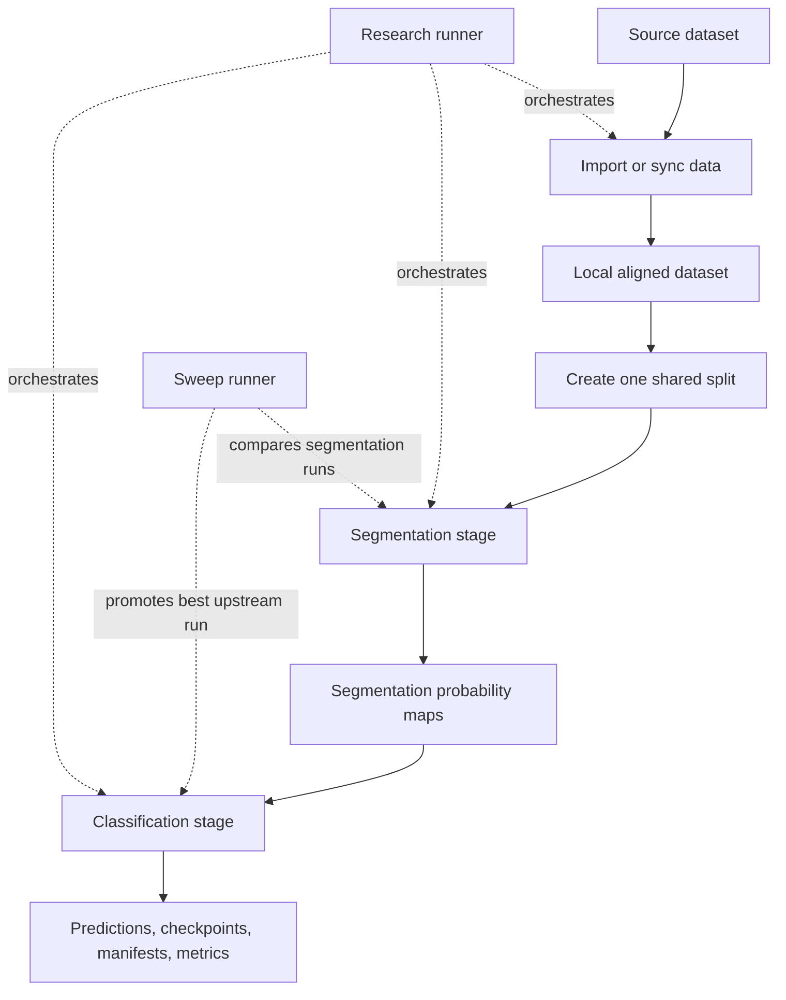

# MRI Pipeline

## Goal

A research pipeline for prostate MRI analysis, split into two stages:

1. **Segmentation** — a 2.5D model (MONAI DynUNet / SegResNet / SwinUNETR family) predicts the prostate gland and suspected lesion regions from stacked T2 + ADC + CALC slices.
2. **Classification** — a downstream model consumes the segmentation predictions alongside the MRI inputs to produce a per-case risk score.

For quick clinical inspection of a single study, a single-call wrapper (`mri/service/pipeline.py`) and a web UI (`mri/service/ui.py`) turn a raw vendor DICOM zip into an annotated, self-contained HTML report.

## Quick start (fresh clone)

Prerequisite: [`uv`](https://docs.astral.sh/uv/).

`dicom_mapper` is declared as a sibling path dependency in `pyproject.toml`, so it must be cloned next to `cancer_detector` before `uv sync`.

```bash
# 1. Clone both repos side by side
git clone git@github.com:ccomkhj/dicom_mapper.git
git clone git@github.com:ccomkhj/cancer_detector.git
cd cancer_detector

# 2. Create the venv and install everything (including the editable dicom_mapper)
uv sync

# 3. Launch the clinician web UI (downloads the default model on first run)
uv run python -m mri.service.ui
```

The UI opens at `http://127.0.0.1:7860/`. Drag in a vendor DICOM `.zip`, click **Analyze** to review metadata, then **Run segmentation** to generate the HTML report.

On the very first launch, a default segmentation checkpoint (~150 MB) is downloaded from the [cancer_detector releases](https://github.com/ccomkhj/cancer_detector/releases) into `checkpoints/default/`. Subsequent launches reuse it. To point at your own checkpoint instead, set `MRI_DEFAULT_CHECKPOINT=/path/to/run_dir` or paste it into the **Advanced** field in the UI.

For the full research workflow (training, sweeps, HPC) see the researcher section below.

## How to use

### Clinician (web UI)

```bash
uv sync
uv run python -m mri.service.ui
```

A browser tab opens at `http://127.0.0.1:7860/`. Upload a vendor DICOM `.zip`, click **Analyze** to review the detected patient metadata and T2 / ADC / CALC series, then click **Run segmentation**. The annotated HTML report opens in a new tab with a banner summarizing any suspected lesion slices.

Override the default checkpoint via the **Advanced** field or the `MRI_DEFAULT_CHECKPOINT` environment variable.

### Researcher / developer

Detailed workflow guides live in [`docs/`](docs/):

- [docs/README.md](docs/README.md) — documentation index
- [docs/setup.md](docs/setup.md) — environment setup and sanity checks
- [docs/data.md](docs/data.md) — import or sync `aligned_v2`
- [docs/splits.md](docs/splits.md) — generate the shared dated split
- [docs/configuration.md](docs/configuration.md) — layered YAML config composition
- [docs/train.md](docs/train.md) — segmentation-first training workflow
- [docs/inference.md](docs/inference.md) — segmentation and classification inference
- [docs/dicom_wrapper.md](docs/dicom_wrapper.md) — single-call DICOM zip wrapper
- [docs/research.md](docs/research.md) — end-to-end local research runner
- [docs/sweeps.md](docs/sweeps.md) — sweep and downstream promotion flow
- [docs/smoke.md](docs/smoke.md) — short CPU smoke workflows
- [docs/slurm.md](docs/slurm.md) — HPC execution via `scripts/new/*`
- [docs/paper_run_checklist.md](docs/paper_run_checklist.md) — checklist for paper runs

**Official execution paths:**

- `mri/cli/{train,infer,pipeline_infer,sweep,research}.py`
- `mri/service/pipeline.py` — DICOM zip → segmentation → HTML report wrapper
- `mri/service/ui.py` — Gradio web UI around the wrapper
- `scripts/new/{train,inference}` — HPC launchers (native; support direct run and `sbatch`)

> **Naming note.** Two unrelated `service/` directories exist:
> - `mri/service/` — modern, part of the `mri/` package. Use this.
> - `service/` (top-level) — legacy compatibility wrappers. Do not use for new work.

## Pipeline flow



Segmentation runs first; classification consumes the selected MRI inputs together with segmentation prediction outputs.
